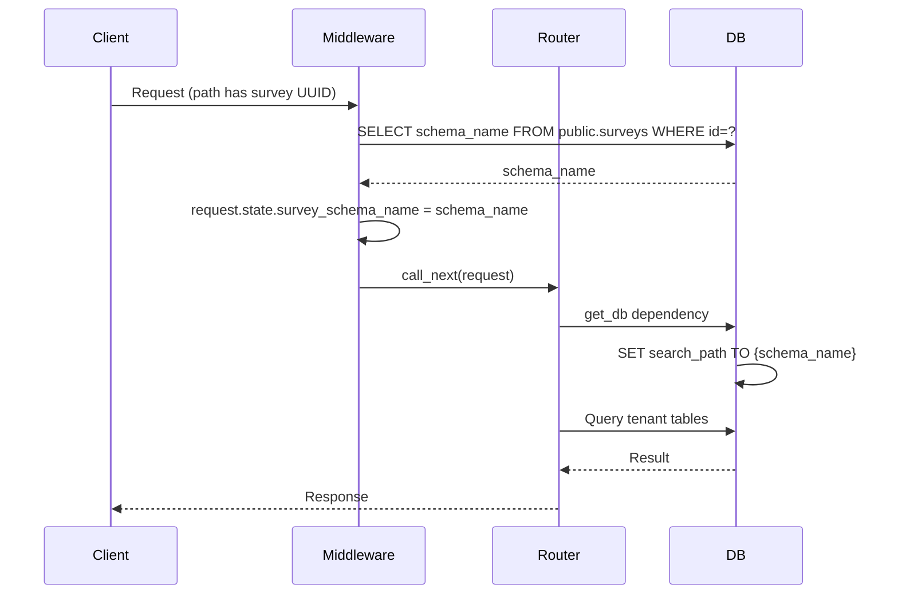
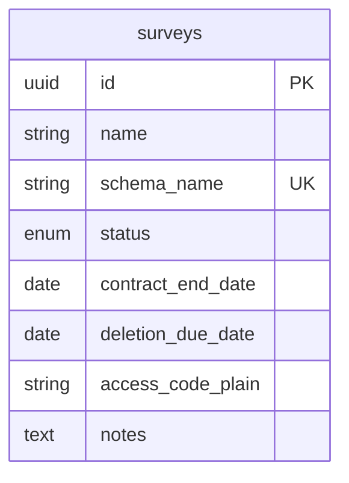
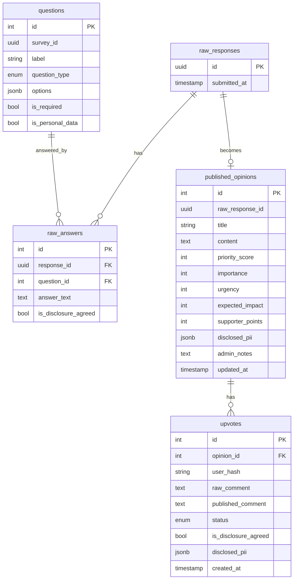

# Technical Design Document

## Overview

**Purpose**: This design enables building the Strategic Survey Engine from scratch—a multi-tenant feedback platform with schema-per-survey isolation, dynamic forms, moderation, and export.

**Users**: Admins (survey provisioning, moderation), Managers (client HR, analysis, export), Contributors (anonymous/public submission).

**Impact**: Physical data isolation per survey, search-first flow to reduce duplicates, PII consent model for evaluation.

### Goals

- Schema-per-survey multi-tenancy with PostgreSQL
- Dynamic question definitions (text, textarea, select, radio)
- Search-first contributor flow with upvoting and moderated comments
- 14-point priority score (Importance, Urgency, Impact, Supporters)
- Manager JWT auth + Excel/PDF export
- Admin API Key or password auth

### Non-Goals

- Nested surveys or hierarchical structures
- Real-time collaboration
- OAuth/social login
- Mobile native apps

## Architecture

### High-Level Architecture

```mermaid
graph TB
    subgraph Client
        AdminUI[Admin UI]
        ManagerUI[Manager UI]
        ContributorUI[Contributor UI]
    end

    subgraph API["FastAPI Backend"]
        AdminRouter[/admin]
        ManagerRouter[/manager]
        SurveyRouter[/survey]
        Middleware[SchemaSwitchingMiddleware]
    end

    subgraph Database["PostgreSQL"]
        Public[public.surveys]
        Tenant1[survey_xxx schema]
        Tenant2[survey_yyy schema]
    end

    AdminUI --> AdminRouter
    ManagerUI --> ManagerRouter
    ContributorUI --> SurveyRouter

    AdminRouter --> Middleware
    ManagerRouter --> Middleware
    SurveyRouter --> Middleware

    Middleware --> Public
    Middleware --> Tenant1
    Middleware --> Tenant2
```

### Request Flow with Schema Switching



### Technology Stack

| Layer | Technology | Rationale |
|-------|------------|-----------|
| Backend | Python 3.11, FastAPI | Async, OpenAPI, Pydantic v2 |
| ORM | SQLAlchemy 2.0, asyncpg | Async PostgreSQL, schema switching |
| Auth | PyJWT (Manager), API Key (Admin) | Stateless JWT, simple admin auth |
| Frontend | React 18, Vite, TypeScript | Fast dev, type safety |
| State | TanStack React Query | Server state, caching |
| Styling | Tailwind CSS | Utility-first, rapid UI |
| Export | openpyxl, reportlab | Excel (.xlsx), PDF |
| DB | PostgreSQL 15+ | Schemas, JSONB, full-text search |
| Migrations | Alembic | public schema only; tenant DDL in code |

## Data Model

### Public Schema



### Tenant Schema (per survey_xxx)



### Priority Score Formula

```
priority_score = (importance + urgency + expected_impact) * 2 + supporter_points
Range: 0-14 (each component 0-2)
```

### GIN Index for Full-Text Search

```sql
CREATE INDEX idx_published_opinions_fts ON {schema}.published_opinions
  USING GIN (to_tsvector('simple', coalesce(title,'') || ' ' || coalesce(content,'')));
```

## API Design

### Admin (`/admin`)

| Method | Path | Description |
|--------|------|-------------|
| POST | /verify-password | Verify password = ADMIN_API_KEY |
| POST | /surveys | Create survey (returns access_code once) |
| GET | /surveys | List surveys |
| GET | /surveys/{id} | Get survey |
| POST | /surveys/{id}/reset-access-code | Regenerate access code |
| DELETE | /surveys/{id} | Delete survey, drop schema |
| POST | /surveys/{id}/questions | Add question |
| GET | /surveys/{id}/questions | List questions |
| DELETE | /surveys/{id}/questions/{qid} | Delete question |
| GET | /surveys/{id}/responses | List raw responses |
| GET | /surveys/{id}/responses/{rid} | Get response with answers |
| GET | /moderation/{id}/submissions | List raw responses (alias) |
| POST | /surveys/{id}/opinions | Create published opinion |
| GET | /surveys/{id}/opinions | List opinions |
| PATCH | /moderation/{id}/opinions/{oid} | Update opinion |
| GET | /moderation/{id}/opinions/{oid}/upvotes | List upvotes |
| PATCH | /moderation/{id}/upvotes/{uid} | Approve/reject upvote |

**Auth**: `X-Admin-API-Key` header or POST /verify-password → session

### Manager (`/manager`)

| Method | Path | Description |
|--------|------|-------------|
| POST | /auth | survey_id + access_code → JWT |
| GET | /{id}/survey | Get survey info (JWT) |
| GET | /{id}/opinions | List opinions with PII |
| GET | /{id}/opinions/{oid}/upvotes | List upvotes with PII |
| GET | /{id}/export?format=xlsx\|pdf | Download report |

**Auth**: JWT in `Authorization: Bearer`

### Survey (Public) (`/survey`)

| Method | Path | Description |
|--------|------|-------------|
| GET | /{id}/questions | Survey metadata + questions |
| POST | /{id}/submit | Submit response with answers |
| GET | /{id}/opinions | List published opinions |
| GET | /{id}/search?q= | Full-text search opinions |
| POST | /{id}/opinions/{oid}/upvote | Upvote + optional comment |

**Auth**: None (UUID in path is the "auth")

## Frontend Routes

| Path | Component | Auth |
|------|-----------|------|
| / | Home | - |
| /admin | SurveyList | AdminGuard |
| /admin/surveys/new | SurveyCreate | AdminGuard |
| /admin/surveys/:id | SurveyDetail | AdminGuard |
| /admin/surveys/:id/moderation | SurveyModeration | AdminGuard |
| /manager/:id | ManagerDashboard | Access code → JWT |
| /survey/:id | SurveySearch | - |
| /survey/:id/post | SurveyPost | - |

## Key Implementation Details

### Schema Switching Middleware

1. Extract survey UUID from path (`/survey/{uuid}/...`, `/manager/{uuid}/...`, `/admin/surveys/{uuid}/...`) or `X-Survey-UUID` header
2. Query `public.surveys` for `schema_name` by UUID
3. Set `request.state.survey_schema_name` and `request.state.survey_id`
4. `get_db` reads state and runs `SET search_path TO {schema_name}` before yielding

### Survey Provisioning (create_survey)

1. Generate UUID, schema name `survey_{uuid8}`, access code (8 alphanumeric)
2. `CREATE SCHEMA IF NOT EXISTS {schema_name}`
3. Run DDL: enums, questions, raw_responses, raw_answers, published_opinions, upvotes, GIN index
4. Insert into `public.surveys` with contract_end_date (+30d), deletion_due_date (+90d)

### User Hash for Upvote Deduplication

```python
hashlib.sha256(f"{request.headers.get('User-Agent','')}{client_host}".encode()).hexdigest()[:64]
```

### PII Handling

- `disclosed_pii` (JSONB) stores `{name, dept, email}` only when `is_disclosure_agreed` is true
- Public API schemas exclude `disclosed_pii`
- Manager and Admin APIs include `disclosed_pii` for consented records

## Docker and CI

- **docker-compose**: db (PostgreSQL 15), backend (Python 3.11-slim), frontend (Node 20)
- **CI**: GitHub Actions, backend (Ruff, mypy, pytest+coverage), frontend (ESLint, Prettier, Jest+coverage), pip/npm cache

## Error Handling

| Scenario | Response |
|----------|----------|
| Invalid/missing Admin API Key | 401 |
| Survey not found | 404 |
| Invalid access code | 401 |
| Survey not active (submit) | 400 |
| Validation error (Pydantic) | 422 |
| ProgrammingError (schema/tables missing) | 404 |
